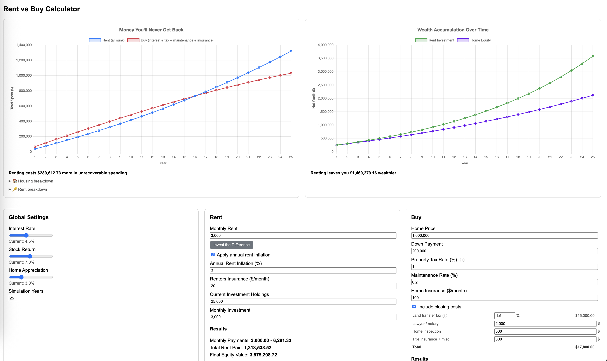

# Rent vs Buy Calculator

An interactive calculator that models the long-term financial outcomes of renting vs. buying a home. It runs a month-by-month simulation over your chosen time horizon, tracking sunk costs, home equity, and investment portfolio growth — so you can see which path leaves you wealthier and by how much.



## Disclaimer

This is not to be construed as financial advice. It is simply a personal tool to help compare renting vs. buying options. This is an open source project — please feel free to review and confirm the math yourself.

## Setup & Run

**Requirements:** Python 3.8+

```bash
# 1. Create and activate a virtual environment
python3 -m venv venv
source venv/bin/activate

# 2. Install dependencies
pip install -r requirements.txt

# 3. Start the server
python app.py
```

Then open [http://localhost:5001](http://localhost:5001) in your browser.
